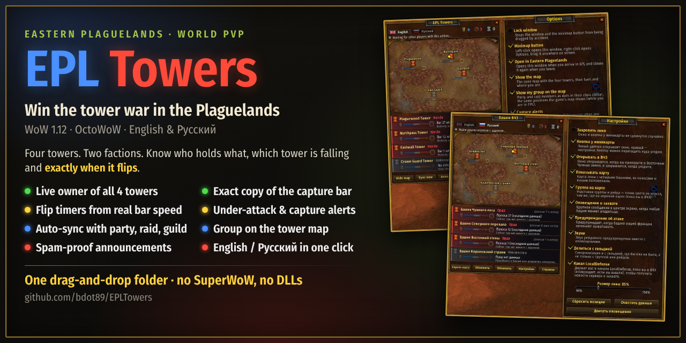
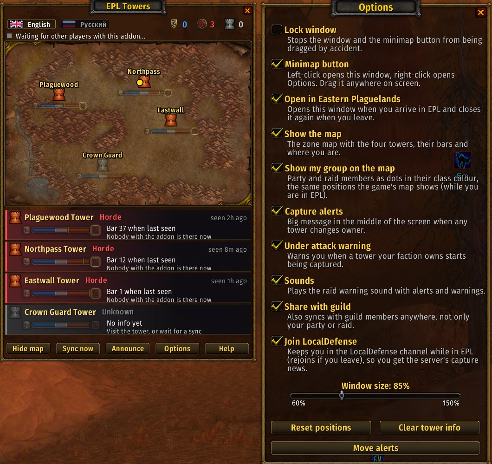
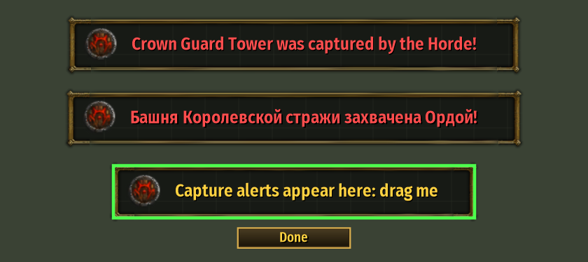
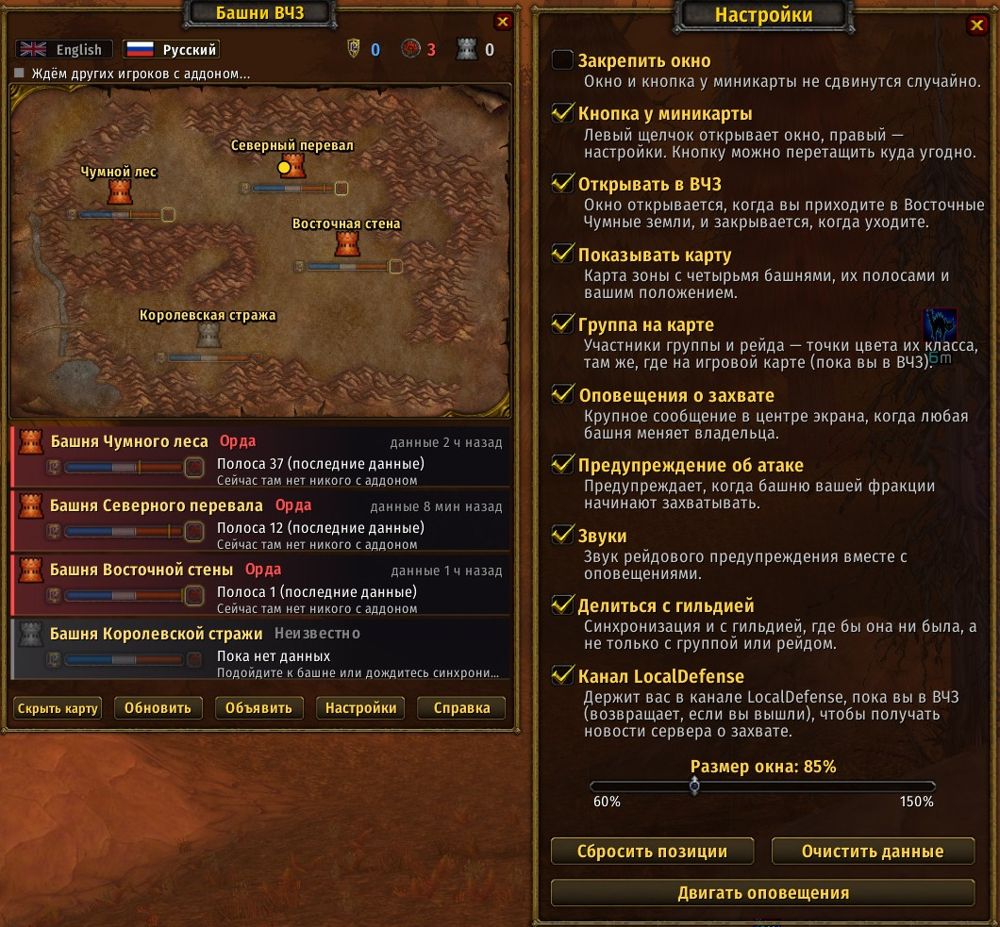

<div align="center">



# EPL Towers

**Win the tower war in the Eastern Plaguelands** · WoW 1.12 · OctoWoW · English &amp; Русский


</div>

Plaguewood, Northpass, Eastwall and Crown Guard: four towers, two factions, one zone. EPL Towers is a
live tracker for the **Eastern Plaguelands world PvP towers** on the vanilla 1.12 client (made for
OctoWoW). Get your group out there and know at a glance who holds what and which tower is falling.

**What it does**

- 🏰 **Live owner of all four towers**, with Alliance / Horde / neutral counts at the top.
- 📊 **An exact copy of the game's capture bar** for every tower, on the map and on each tower card.
- ⏱️ **Flip timers measured from the real bar speed**, so 1 capper or 10 cappers both give the right time.
- ⚔️ **Capture and under-attack alerts** in a banner you can move anywhere.
- 🔄 **Automatic sync** with your party, raid and guild: one player at a tower feeds everyone.
- 🗺️ **Tower map** with you and your party/raid members in class colours.
- 📣 **Announcements that can't be spammed**, even with ten people running the addon at one tower.
- 🛡️ **Keeps you in LocalDefense** while you're in the zone (can be turned off).
- 🇬🇧 🇷🇺 **English and Russian** with one click, with its own font so Cyrillic shows properly.
- 📦 **One drag-and-drop folder.** No other addons, DLLs or SuperWoW needed: only the normal 1.12 game API.



*In game (English), with the Options panel open next to the main window. The gold dot on the map is
the player at Northpass. The tower cards show each tower's last reading and how old it is, and the
Options panel explains every setting in one line.*

Only players who have the addon can share data, so give it to your group.

---

## Install

1. Download **`EPLTowers-2.2.zip`** from the [Releases](../../releases) page.
2. Unzip it into your game folder under `Interface\AddOns\`. You should end up with
   `Interface\AddOns\EPLTowers\EPLTowers.toc`.
   - If you used the green **Code > Download ZIP** button instead, the folder is called
     `EPLTowers-main`. Rename it to **`EPLTowers`** or the game won't load it.
3. Start the game (or type `/reload`). Click the banner button by the minimap, or type `/eplt`.

---

## The window

| Part | What it means |
|---|---|
| **Title plaque** | Drag it to move the window. |
| **Flags** (English / Русский) | Switch the language of the whole addon. |
| **Crests and numbers** | How many towers the Alliance, the Horde and nobody (neutral) hold. |
| **Sync line** | Whether anyone is sharing tower data with you right now. Hover it for the list of players with the addon. |
| **Map** | The four towers with the game's tower icons. **Blue** = Alliance, **red** = Horde, **grey** = neutral/unknown, **half-grey** = that side's tower is being captured. Under each tower is a mini capture bar and the next timer. **Gold dot** = you, **coloured dots** = your party/raid in class colours (hover for names and health). |
| **Tower cards** | Owner, **LIVE** (someone with the addon is at that tower now) or how old the last reading is, a copy of the capture bar, and the timers. |
| **Buttons** | **Hide map**, **Sync now**, **Announce**, **Options**, **Help**. Every button has a tooltip. |

Click any tower (on the map or its card) to **announce just that tower** or **set its owner by hand**.

### Reading the capture bar

The bar is an exact copy of the game's own capture bar: same artwork, same layout, same position
formula (taken from the client's `WorldStateFrame.lua`).

| Bar value | Side of the bar | Owner |
|---|---|---|
| **61 – 100** | blue (left) | Alliance (100 = full) |
| **40 – 60** | grey (middle) | Neutral |
| **1 – 39** | red (right) | Horde (1 = full) |

The little arrow on the marker shows which way the bar is moving. The glowing crest at one end
shows which side currently holds it.

### Timers

The timers come from the **real bar movement**, not from guesses:

- One player capping alone moves the bar **one point every 24 seconds** (measured on OctoWoW).
  That means: full to **neutral ≈ 16 min**, full to **captured ≈ 24 min**, end to end **≈ 40 min**.
- More players capture faster. The addon measures the speed from the last few bar moves and
  notices straight away when people arrive, leave or die.
- Each card shows the next step (e.g. *"Horde in 5:12"*) and the steps after it with the speed
  (*"then Full Horde 20:24  24s/pt"*). Hover a tower for the full list and the speed compared to one player.

| You see | Meaning |
|---|---|
| **in 5:12** | Measured. Exact to the second while the tower is LIVE. |
| **within 5:12** | The speed isn't measured yet (the bar has moved only once). This is the slowest case, so it will be sooner if more people are capping. |
| **slowing down** | The bar is late for its next point, so cappers have left or died. The times stretch to match. |
| **any moment** | Due now (the game skips the values 60 and 40, so those steps take twice as long). |
| **not moving** | Nobody is capping, or both sides have equal numbers. |
| **secure** | The bar is full and nobody is capturing it. |

---

## Sync (automatic)

You don't need to press anything:

- When you **log in**, **enter Eastern Plaguelands** or **join a group**, the addon asks your
  party/raid and guild what they know. One player answers; the others stay quiet.
- Anyone standing at a tower shares its bar the moment it moves, plus every 10 seconds. If ten people
  with the addon stand at one tower, only one of them sends each update.
- In EPL it asks again by itself every 5 minutes if it hasn't heard anything.
- **Sync now** asks immediately (at most once every 5 seconds).

---

## Announcements (they can't be spammed)

**Announce** posts the towers in raid or party chat (**Shift-click** for guild chat). For example:

```
[EPL Towers] Plaguewood: Horde (19m ago) / Northpass: Horde, Alliance capping, Neutral in 2:10 / Eastwall: Horde (11m ago) / Crown Guard: unknown
```

To stop chat filling up when several people have the addon:

- The **same announcement goes out at most once every 30 seconds for the whole group**. Everyone's
  addon remembers every announcement it sees, including ones from older versions (it reads them in chat).
- An "all towers" post also counts for each single tower.
- If two people click at the same moment, both addons agree which one posts (by name), and the
  other one doesn't.
- If yours is blocked, you are told who posted it and when, and the text is shown to you only.

---

## Alerts, and moving them



*Preview of the alert banner (English, Russian, and the anchor mode used to move it).*

- **Capture alert:** a banner with the faction crest whenever any tower changes owner.
- **Under attack warning:** when a tower your faction owns starts being captured, with the time left.
- **To move the banner:** **Options > Move alerts** (or `/eplt anchor`). The banner appears with a green
  border; drag it where you like and click **Done**. **Reset positions** puts everything back.

---

## Options

*The Options panel is the right-hand half of the screenshots at the top (English) and under
[Languages](#languages--языки) (Russian).*

Every option has its description underneath. **Window size** scales the main window from 60% to 150%.
**Clear tower info** needs two clicks so it can't happen by accident.

**Join LocalDefense** keeps you in the zone's LocalDefense channel while you are in Eastern
Plaguelands, so you get the server's own capture messages. Turn it off if you don't want that channel.

---

## Languages / Языки



*The same moment in Russian: the whole addon, Options included, switches with one click on the flags.*

**The Russian window, part by part:**

| Russian | English |
|---|---|
| **Башни ВЧЗ** / **Настройки** (titles) | EPL Towers / Options |
| Ждём других игроков с аддоном… | Waiting for other players with this addon… |
| Чумной лес · Северный перевал · Восточная стена · Королевская стража | Plaguewood · Northpass · Eastwall · Crown Guard |
| Альянс · Орда · Нейтральная · Неизвестно | Alliance · Horde · Neutral · Unknown |
| данные 2 ч назад · данные 8 мин назад | seen 2h ago · seen 8m ago |
| Полоса 37 (последние данные) | Bar 37 when last seen |
| Сейчас там нет никого с аддоном | Nobody with the addon is there now |
| Пока нет данных | No info yet |
| **ВЖИВУЮ** | LIVE (someone with the addon is at the tower) |
| Орда через 5:12 · затем … 24 с/дел. | Horde in 5:12 · then … 24 s per point |
| Скрыть карту · Обновить · Объявить · Настройки · Справка | Hide map · Sync now · Announce · Options · Help |
| Сбросить позиции · Очистить данные · Двигать оповещения | Reset positions · Clear tower info · Move alerts |

- Click the flags at the top (or type `/eplt en`, `/eplt ru`). Players on a Russian game client get Russian automatically.
- The game's normal font has **no Cyrillic letters**, so the addon brings its own font
  (Fira Sans Condensed). Russian text shows properly for everyone who installs the addon.
- Announcements are sent in the language you picked. Chat fonts do have Cyrillic, so everyone can read them.

---

## Slash commands

| Command | Does |
|---|---|
| `/eplt` | Show or hide the window |
| `/eplt sync` | Ask your group and guild for tower info now |
| `/eplt announce` | Post all towers in raid/party chat (`/eplt announce guild` for guild) |
| `/eplt options` | Options |
| `/eplt help` | How it works (in game) |
| `/eplt map` | Show or hide the map |
| `/eplt lock` | Lock or unlock moving the window and minimap button |
| `/eplt anchor` | Move the alert banner |
| `/eplt set cg horde` | Set a tower's owner by hand (`pw`, `np`, `ew`, `cg` + `alliance`, `horde`, `neutral`) |
| `/eplt defense` | Join the LocalDefense channel now |
| `/eplt en`, `/eplt ru` | Language |
| `/eplt reset` | Clear all tower info (type it twice) |
| `/eplt log` | Show the last owner changes and capture messages the addon saw |

---

## Known limits

- **Data needs a person.** A tower is only LIVE while someone with the addon is in range of it.
  Otherwise you see the last reading and its age.
- **Group dots** show while you are in Eastern Plaguelands, the same as the game's own map.
- On OctoWoW the "Towers Controlled" counters and the world map icons don't update, so the
  addon relies on the capture bar, which is the only reliable signal.
- Not seen in game yet: the exact wording of the server's LocalDefense capture message. If one
  appears, `/eplt log` will show it.

---

## Русский — кратко

**Башни ВЧЗ** показывают владельца каждой из четырёх башен Восточных Чумных земель, точную копию
игровой полосы захвата и время до смены владельца. Данные сами передаются группе, рейду и гильдии.

- **Установка:** распакуйте `EPLTowers-2.2.zip` в `Interface\AddOns\`, чтобы получилось
  `Interface\AddOns\EPLTowers\EPLTowers.toc`. Затем `/reload`, кнопка у миникарты или `/eplt`.
- **Язык:** флажки вверху окна или `/eplt ru`.
- **Полоса:** синяя сторона (61–100) — Альянс, серая середина (40–60) — нейтральная, красная (1–39) — Орда.
- **Таймеры** измеряются по настоящей полосе: один игрок — одно деление за 24 секунды
  (до нейтральной ≈ 16 мин, до захвата ≈ 24 мин). «В течение» — скорость ещё измеряется.
- **ВЖИВУЮ** — кто-то с аддоном стоит у башни прямо сейчас.
- **Объявить** — пишет башни в чат. Одно и то же сообщение уходит от всей группы не чаще раза в 30 секунд.
- **Оповещения** можно передвинуть: «Настройки» > «Двигать оповещения» (или `/eplt anchor`), затем «Готово».
- На карте золотая точка — вы, цветные точки — ваша группа.

---

## For addon authors: how sync works

Addon messages use the prefix `EPLT` over RAID/PARTY and GUILD:

| Message | Meaning |
|---|---|
| `B:KEY:value:neutral:since:secsPerPoint:dir` | Live bar from a player at the tower (`since` = seconds since the value changed, to 0.1 s) |
| `O:KEY:Faction:ageSecs` | Owner news (LocalDefense line or set by hand) |
| `Q:` / `Q:2` | "What do you know?" (1.x / 2.x) |
| `S:KEY,owner,ownerAge,value,neutral,valueAge,since,spp,dir;...` | Everything one player knows (reply to `Q`) |
| `A:KEY or ALL:RAID/PARTY/GUILD` | Claim before posting an announcement (shared 30 s cooldown) |

Tower keys: `PW` Plaguewood, `NP` Northpass, `EW` Eastwall, `CG` Crown Guard.
Version 1.x clients understand `B`, `O` and `Q`; they ignore the rest.

Files: `EPLTowers.lua` (state, timers, sync), `Locale.lua` (English and Russian text),
`EPLTowersUI.lua` (window, map, options, help, alerts, minimap button), `fonts/`, `media/`
(flags and the map dot, generated), `docs/` (these pictures).

---

## Changelog

- **2.2**: Announcements can't be spammed (shared 30 s cooldown, two-click tie-break). Movable
  alert banner (anchor mode). Party/raid members on the map. "Sync now" limited to once every 5 s.
  LocalDefense news passed on by one player only. Options buttons fixed, and panels drawn above other addons.
- **2.1**: Russian translation with flag toggle and bundled Cyrillic font. New look: gold dialog
  frame, title plaque, faction crests, tower cards, styled buttons, alert banner.
- **2.0**: Rewrite. Button UI with descriptions, options, help, draggable minimap button,
  automatic sync, exact copy of the game's capture bar, timers measured from real bar movement.
- **1.0**: First version.

## Credits

- Font: **Fira Sans Condensed** by the Mozilla Foundation and Telefonica S.A., SIL Open Font License 1.1 (`fonts/OFL.txt`).
- Tower icons, capture bar, frames and crests are the game's own textures, loaded from your client
  (not included in this repository).
